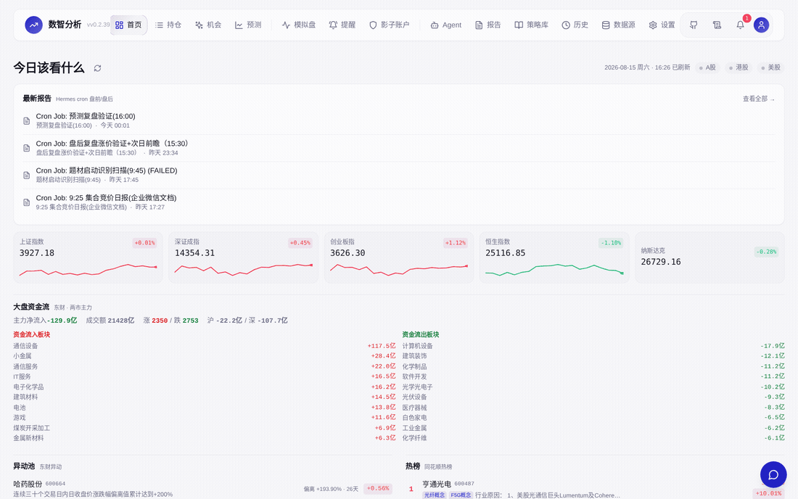
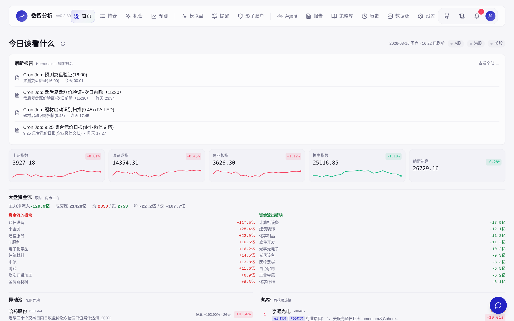
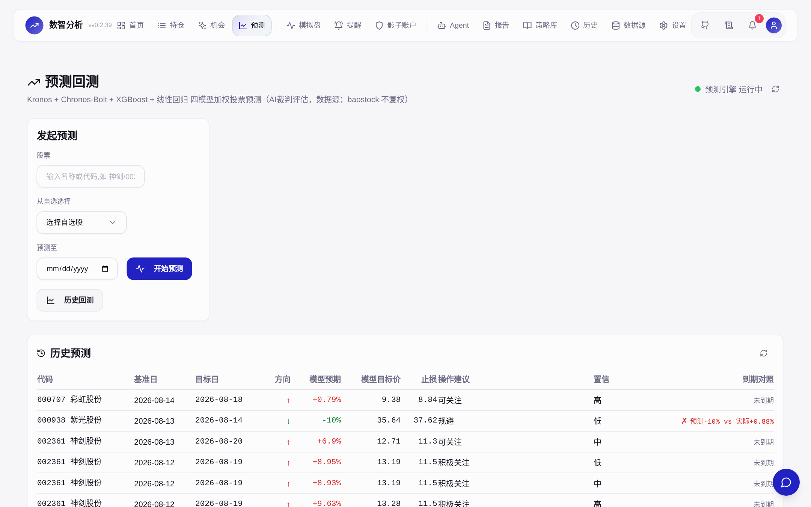
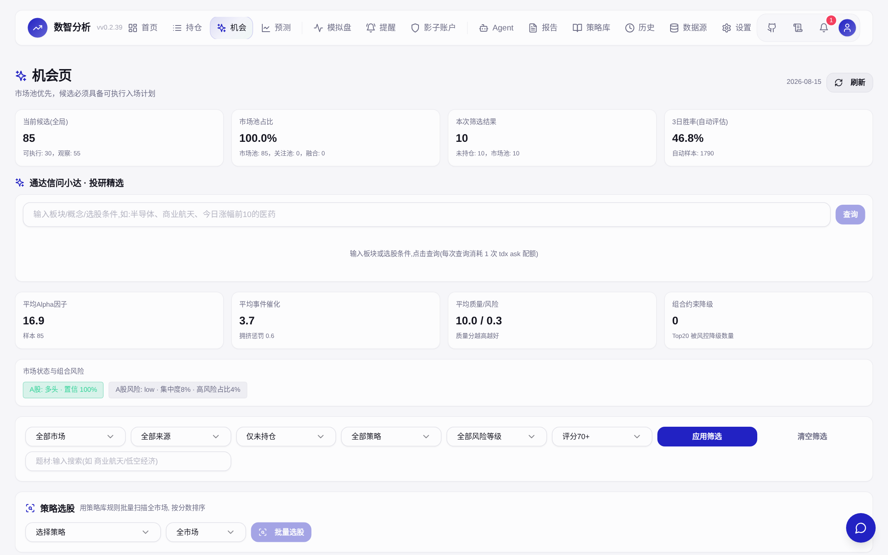

<div align="center">

# SIDA · Stock-Intelligent-Data-Analytics

**Open-source AI investment terminal for China A-shares** — market data → AI analysis → 4-model prediction → verification loop → WeChat push, all in one self-hosted system.

[](LICENSE)

[](https://github.com/xiaoze-hub/Stock-Intelligent-Data-Analytics/pkgs/container/stock-intelligent-data-analytics)

*Language: [English](README.md) · [中文](README.zh-CN.md)*



</div>

---

## Why SIDA?

Most A-share tools show you **data**. SIDA closes the loop: it **reads the market, thinks about it, predicts it, verifies its own predictions, and talks to you on WeChat** — a full AI pipeline where every step is traceable.

- 🔍 **Main-force intent analysis** (主力意图) — tick-level order flow: accumulation/distribution detection, order splitting, support/resistance game
- 🔮 **4-model prediction with verification loop** — Kronos + Chronos-Bolt + XGBoost + linear regression weighted voting, **weights dynamically adjusted by historical hit rate**, every prediction auto-checked against reality when it expires (hit/miss with actual returns)
- 🤖 **AI assistant with 19+ data tools** — streaming chat, image/file/link multimodal, official Q&A (互动易), hot lists, anomaly pool, auction data
- 📱 **WeChat two-way dialog** — bind your personal WeChat via official iLink protocol, ask about any stock right from your phone, receive push reports
- 📊 **Auto reports** — pre-market (8:30) / post-market (15:30) reports with real data + AI commentary, generated daily by cron
- 🏆 **Event-driven opportunity discovery** — 7 strategy signals, anomaly pool, hot boards, theme-launch detection — find themes *before* they take off

## Screenshots

| Dashboard | Forecast & verification | Opportunities |
|---|---|---|
|  |  |  |

*Live demo (read-only): [https://www.sida.example.com](https://www.sida.example.com) — contact us for demo access*

## Quick Start

### Docker (recommended)

```bash
# GitHub Container Registry (global) or Aliyun ACR (fast in China)
docker pull ghcr.io/xiaoze-hub/stock-intelligent-data-analytics:latest
# or: docker pull crpi-mte80ai8o78b1429.cn-shanghai.personal.cr.aliyuncs.com/xiaozexwz/xzxwz:v0.2.41

docker run -d --name sida -p 8000:8000 --restart unless-stopped \
  -v sida_data:/app/data \
  -e AUTH_USERNAME=admin \
  -e AUTH_PASSWORD=your_password \
  -e TZ=Asia/Shanghai \
  ghcr.io/xiaoze-hub/stock-intelligent-data-analytics:latest
```

Open http://localhost:8000 — that's it.

### Development

```bash
# Backend
pip install -r requirements.txt
python server.py

# Frontend
cd frontend && pnpm install && pnpm dev
```

## Architecture

```
┌─────────────┐   ┌──────────────┐   ┌──────────────┐   ┌────────────┐
│ Market data │ → │  AI analysis │ → │   Prediction │ → │  Reports   │
│ Tencent/EM/ │   │ main-force   │   │ 4 models +   │   │ pre/post   │
│ THS/auction │   │ technical    │   │ AI adjudicator│   │ auto-gen   │
└─────────────┘   └──────────────┘   └──────────────┘   └────────────┘
      │                  │                 │                  │
      └────── AI assistant (SIDA Bot) ←────┘                  │
                     │ image/file/link multimodal              │
                     ▼                                        │
             ┌─────────────┐                                  │
             │ WeChat push │ ←────────────────────────────────┘
             │  iLink P2P  │
             └─────────────┘
```

| Layer | Tech |
|---|---|
| Backend | Python FastAPI + SQLAlchemy + SQLite(WAL) + APScheduler |
| Frontend | React 18 + Vite + Tailwind + ECharts |
| Prediction | Kronos / Chronos-Bolt (time-series foundation models) + XGBoost + Linear Regression |
| WeChat | Tencent official iLink Bot API (pure Python, QR-code binding) |
| AI config | Unified LLM config center (multi-provider + scene binding) |

## Open-source vs Pro

| | Open-source (this repo) | Pro (paid) |
|---|---|---|
| License | AGPL-3.0 | Closed source |
| Core: data, analysis, prediction, chat | ✅ | ✅ |
| Full feature set / premium models | Partial | Full |
| Managed cloud / priority support | — | ✅ |

The open-source edition is fully self-hostable and free. The Pro edition unlocks the complete feature set — built for users who want zero-maintenance operation.

## Multi-user & AI config

- **Account isolation**: positions, watchlists, notification channels, WeChat bindings are per-user
- **Unified LLM config center**: providers (OpenAI-compatible), model pools, 7 scene bindings (chat/reports/adjudicator/QA/scoring/deep-analysis/vision)
- **Notification channels**: WeChat (iLink) / WeCom / PushPlus / ServerChan / Email

## Data sources

Tencent / Eastmoney / THS / Sina / TDX (问小达) / Cninfo (互动易) — quotes, K-lines, minute data, capital flow, tick-level trades, auctions, limit-up pools, hot boards, anomaly pool, dragon-tiger lists, margin trading, shareholders, dividends.

## Disclaimer

This project is for technical research and learning only. All AI-generated analysis, predictions, and reports are for reference only and **do not constitute investment advice**. Markets are risky; invest with caution.

---

## Sponsor

If SIDA helps you, consider buying the author a coffee ☕ — your support keeps this project alive!

| Method | Entry |
|:---:|:---:|
| **WeChat Reward** |  |

> Tip: click ⭐ **Star** on the top-right to support the project.
