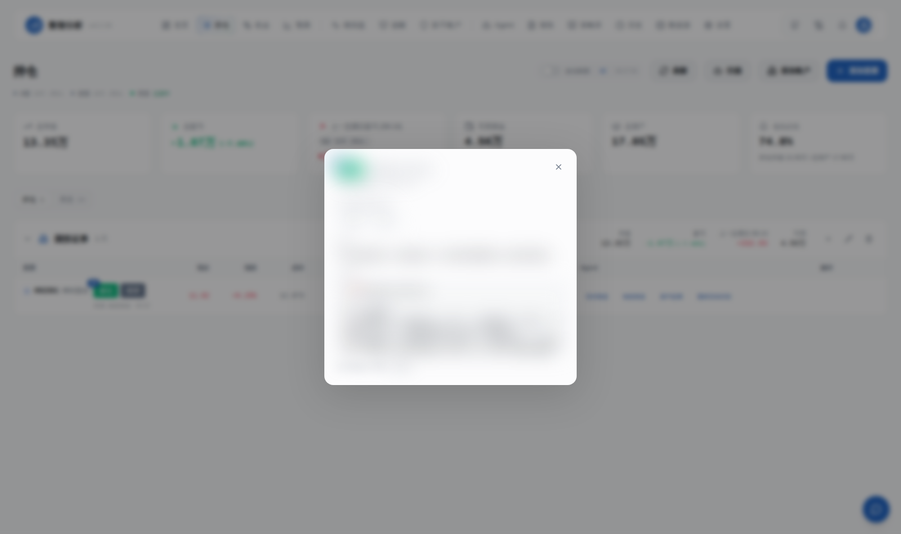

# 数智分析 (Stock-Intelligent-Data-Analytics)

**自托管 AI 盯盘助手 · 集成 [TradingAgents](https://github.com/TauricResearch/TradingAgents) 多 Agent 投资决策** — A 股 / 港股 / 美股实时监控、持仓管理、智能分析、策略库、报告中心、消息通知、全渠道推送

[](https://github.com/xiaoze-hub/Stock-Intelligent-Data-Analytics/stargazers)
[](https://github.com/xiaoze-hub/Stock-Intelligent-Data-Analytics/pkgs/container/stock-intelligent-data-analytics)
[](LICENSE)
[](https://github.com/xiaoze-hub/Stock-Intelligent-Data-Analytics/commits/main)
[](https://github.com/xiaoze-hub/Stock-Intelligent-Data-Analytics)


> 🧠 **持仓页点一下 → TradingAgents 9-Agent 投研团队接力分析 → 看多看空辩论 → 风控审查 → PM 决策书,3-5 分钟一条完整推理链,结论直推到你的 IM。**

## 📸 功能一览

| 持仓 · 多账户汇总 | 机会页 · AI 评分选股 |
|:---:|:---:|
|  |  |
| **模拟盘 · 净值曲线 + 绩效** | **个股深度详情** |
|  |  |
| **技术指标共振 · 一眼 MACD/RSI/KDJ** | **价格提醒 · 条件组合触发** |
|  |  |

<details>
<summary>移动端截图</summary>

 

> 📱 支持 PWA，移动端可「添加到主屏幕」当原生 App 用。

</details>

> 💡 如果数智分析对你有帮助，点右上角 ⭐ **Star** 支持一下 —— 这是对开源项目最好的鼓励，也能让更多人发现它。

## 🧠 深度分析：TradingAgents 多 Agent 决策

接入 [TradingAgents](https://github.com/TauricResearch/TradingAgents)（76k+ star）多 Agent 投资决策框架，在持仓页点 🧠 图标即可触发：

- **4 类分析师**（技术 / 情绪 / 新闻 / 基本面） → **看多看空辩论** → **风控审查** → **PM 整合决策**
- 3-5 分钟输出完整推理链，结论同步推送到 Telegram / 微信 / 钉钉
- 默认 deepseek-chat，单次 ~$0.05，月度预算可控

## 为什么选择数智分析？

- **数据私有** — 自托管部署，持仓数据不经过任何第三方
- **AI 原生** — 不是简单的指标堆砌，而是让 AI 理解你的持仓、风格和目标
- **开箱即用** — Docker 一键部署，5 分钟完成配置
- **零鉴权数据源** — 集成 [a-stock-data](https://github.com/simonlin1212/a-stock-data) 风格的 SKILL.md 工具包（互动易/异动池/同花顺热点/板块资金流）作为额外补充层

## 核心功能

<details open>
<summary><b>📚 策略库（多因子 YAML 选股）</b></summary>

策略引擎读 `strategies/panwatch_strategies.yaml`（借鉴 [alphasift](https://github.com/ZhuLinsen/alphasift)），从全市场候选股跑横截面因子打分。当前内置 6 套策略：

| 策略 | 标签 | 因子 | 适合 |
|------|------|------|------|
| **双低选股** | value / defensive / low_valuation | PE+PB+活跃度 | 价值投资 / 防御 |
| **资金热度(短线)** | capital_flow / short_term | 主力+大单+异动 | 短线博弈 |
| **放量突破** | momentum / volume_breakout | 量比+涨幅+MACD | 趋势启动 |
| **超卖反弹** | reversal / oversold | RSI+KDJ+换手 | 抄底 |
| **动量+质量** | momentum / quality | 多周期动量+ROE | 波段持有 |
| **低波质量(防御)** | defensive / low_volatility | 历史波动率+夏普 | 资产配置 |

每条策略输出 `entry_candidates`(候选股) + `strategy_signal_runs`(买/卖/持有信号+置信度+因子分解)，落库容器 DB。

**YAML 示例**（双低选股）：
```yaml
dual_low:
  display_name: "双低选股(价值)"
  category: "value"
  filter:
    price_min: 3
    price_max: 80
    change_pct_min: -4.5
    turnover_rate_min: 0.5  # 避免死水低估值
  pe_ttm_max: 15
  pb_max: 2.0
  market_cap_min: 50
  ranking_factors:
    low_pe: 0.4
    low_pb: 0.3
```

**特点**：
- 实时可拿字段（腾讯 + ftshare）和盘后字段（东财 PE/PB/市值）自动分级，缺失时跳过过滤项并在报告里标注「⚠️ 数据缺失」
- 自定义策略：在 YAML 里加一段即可，无需改代码

</details>

<details open>
<summary><b>📊 报告中心（多源报告聚合 + Obsidian 同步）</b></summary>

聚合所有 Agent / cron / 定时任务产出的 Markdown 报告，统一在 Web UI 展示。

**报告来源**：
- `盘前扫描` / `盘后复盘` / `盘中监测` / `个股诊断` / `行业研究` / `事件点评`（cron 自动生成）
- `预测报告`（8010 预测引擎 + 企微版 + dashboard 版双格式）
- `回测报告`（策略回测产出）

**API 端点**（`/api/reports/*`）：
- `GET /reports/list` — 列出所有报告（按日期 / Job 分组）
- `GET /reports/content?date=YYYY-MM-DD&job=xxx` — 读取精修版正文（自动去 cron 元信息噪音）
- `POST /reports/sync-to-vault` — 同步到 Obsidian vault
- `GET /reports/vault-status` — 同步状态检查

**Obsidian 同步**：
- 目标目录：`~/Obsidian/FinanceVault/03-CronReports/<job_name>/YYYY-MM-DD.md`
- 自动去噪（剥掉 `## Prompt` + skill 定义 + 整段 `## Response` 前的元信息），保留 `# 📈 ...` 起的精修正文
- 容器挂载配置：`OBSIDIAN_VAULT=/obsidian-vault` + `-v /home/ubuntu/Obsidian/FinanceVault:/obsidian-vault:rw`

**报告中心 Dialog**：点开直接是去噪后的精修正文（不带原始 cron 元信息噪音）。

</details>

<details open>
<summary><b>🔔 站内消息通知中心（顶栏铃铛）</b></summary>

后台任务完成/失败/推送状态，落地到站内消息中心，顶栏铃铛徽标实时显示未读数。

**API 端点**（`/api/notifications/*`）：
- `GET /notifications` — 列出消息（分页 / 筛选）
- `GET /notifications/unread-count` — 未读数（顶栏徽标）
- `POST /notifications/{id}/read` — 标记已读
- `POST /notifications/read-all` — 一键全部已读
- `DELETE /notifications/clear` — 清空
- `POST /notifications/test` — 测试推送

**消息分类**：
- `category`: agent_run / forecast / system / alert / sync / backtest
- `level`: info / warning / error / success
- 含 `push_status`（推送成功/失败）+ `push_error`（失败原因）+ `trace_id`（追踪 ID）

**典型场景**：
- 8010 预测完成后推送企微 → 站内同步落一条 `forecast 报告已生成`
- 后台 cron 失败 → 站内立即落 `error 系统异常: <job> 运行失败`
- 价格提醒触发 → `alert 600519 突破 1300` + 同时落站内 + 推 IM

</details>

<details open>
<summary><b>🤖 AI 助手（8 个内置工具）</b></summary>

Web UI 顶栏 ChatWidget，AI 自动选工具回答你的问题。**8 个内置工具**：

| 工具 | 用途 | 数据源 |
|------|------|--------|
| `get_portfolio` | 查看持仓 + 盈亏 | 容器 DB |
| `get_stock_quote` | 实时行情（价格/涨跌/换手/PE/PB） | 腾讯接口 |
| `get_technical_analysis` | 技术面（MACD/RSI/KDJ/均线） | 容器内计算 |
| `get_stock_suggestions` | 个股 AI 建议（从历史追踪） | 容器 DB |
| `get_watchlist` | 自选股列表 | 容器 DB |
| `get_capital_flow` | 主力/超大/大/中/小单资金流 + 5 日趋势 | marketdata vendor（东财口径） |
| `tdx_wenda` | 通达信问小达：自然语言跨主题查询（"今日主力净流入前10的半导体"） | 问小达 MCP |
| **`get_market_news`** 🆕 | 财经热点 + 每日简报（早/午/收盘/晚盘） | wudao news_hotlist + briefings |

**为什么有 `get_market_news` 工具**：之前 AI 助手被问"今天有什么新闻"会用训练知识编造（用户反馈"AI 编造数字"高频陷阱）。该工具强制 AI 调真实数据源，没数据时显式标注"暂无"而不是瞎编。

**示例 prompt**：
- "查一下 002361 神剑的资金面"
- "今天有哪些半导体股涨停"
- "帮我看看 600519 估值"
- "今天有什么新闻" → 强制调 get_market_news
- "近 3 日主力净流入前 10 的医药股"

</details>

<details>
<summary><b>🧠 智能 Agent 系统（8 套）</b></summary>

| Agent | 触发时机 | 功能 |
|-------|---------|------|
| **盘前分析** | 每日开盘前 | 综合隔夜美股、新闻消息、技术形态，给出今日操作策略 |
| **竞价复盘** | 每日 9:30 | wudao 竞价数据 + 情绪定性/主线定向/盯盘名单三件套，识别开盘博弈信号 |
| **盘中监测** | 交易时段实时 | 监控异动信号，RSI/KDJ/MACD 共振时推送提醒（含资金面/板块面/情绪面四维分析） |
| **题材启动识别** | 每日 9:45 | 开盘后识别「刚启动」的新题材 + 首板候选，提前潜伏而非追高（涨停池 + 板块分布） |
| **短线归因** | 个股异动时 | 5W 证据收集 + 触发/主因/载体三拆解，判断异动背后的核心原因 |
| **技术分析** | 按需触发（多模态 K 线图） | 趋势/动量/量价/形态/支撑压力五维综合分析 |
| **盘后日报** | 每日收盘后 | 复盘当日走势，分析资金流向，规划次日操作 |
| **新闻速递** | 定时采集 | 抓取财经新闻，AI 筛选与持仓相关的重要信息 |

> 另有按需触发的 **TradingAgents 9-Agent 投研团队**（持仓页点 🧠 图标）—— 4 类分析师 → 看多看空辩论 → 风控审查 → PM 整合决策，详见上方「🧠 深度分析」章节。

</details>

<details>
<summary><b>📈 专业技术分析</b></summary>

- **趋势指标**：MA 多空排列、MACD 金叉死叉、布林带突破
- **动量指标**：RSI 超买超卖、KDJ 钝化与背离
- **量价分析**：量比异动、缩量回调、放量突破
- **形态识别**：锤子线、吞没形态、十字星等 K 线形态
- **支撑压力**：自动计算多级支撑位和压力位

</details>

<details>
<summary><b>🌐 多市场 & 多账户</b></summary>

- **覆盖市场**：A 股、港股、美股实时行情
- **账户管理**：支持多券商账户独立管理，汇总展示总资产
- **交易风格**：按短线/波段/长线分别设置，AI 建议更精准

</details>

<details>
<summary><b>📲 全渠道通知</b></summary>

Telegram / 企业微信 / 钉钉 / 飞书 / Bark / 自定义 Webhook + **站内消息中心**（顶栏铃铛）

</details>

<details>
<summary><b>🔔 价格提醒</b></summary>

- 支持价格、涨跌幅、成交额、量比等条件组合（AND / OR）
- 支持交易时段/全天生效、冷却时间、日触发上限、重复触发模式
- 到期时间使用弹窗内日期面板 + `HH:mm` 输入，留空表示永不过期
- 可按规则选择通知渠道，不选则走系统默认渠道

</details>

## 快速开始

```bash
docker run -d \
  --name panwatch \
  -p 8000:8000 \
  -v panwatch_data:/app/data \
  ghcr.io/xiaoze-hub/stock-intelligent-data-analytics:latest
```

访问 `http://localhost:8000`，首次使用设置账号密码即可。

说明：镜像内已包含 Playwright 运行所需的系统依赖；Chromium 浏览器会在容器首次启动时自动下载并安装到挂载卷（默认 `/app/data/playwright`），首次启动可能需要几分钟且需要网络可达。

如果不需要截图等浏览器能力，可以在启动容器时设置 `PLAYWRIGHT_SKIP_BROWSER_INSTALL=1` 跳过首次 Chromium 下载/安装。

<details>
<summary><b>Docker Compose（含预测引擎 · 推荐）</b></summary>

一行启动**主后端 8000 + 预测引擎 8010**(Kronos/XGBoost/Lag-Llama/LinearReg 四模型融合预测 + 回测)。

仓库根目录已带 `docker-compose.yml`,只需:

```bash
# 1. 拉两个公开镜像(匿名可拉,无需 PAT)
docker compose pull

# 2. 一键启动
docker compose up -d

# 3. 等 60 秒(预测引擎加载 Kronos 慢),访问 http://localhost:8000
```

镜像源(已公开):
- `ghcr.io/xiaoze-hub/stock-intelligent-data-analytics:latest` — 主后端 8000
- `ghcr.io/xiaoze-hub/stock-intelligent-data-analytics-forecast:latest` — 预测引擎 8010

数据持久化: 命名卷 `panwatch_data`(主后端 DB + Playwright 浏览器) + `panwatch_forecast_data`(预测历史 SQLite + 回测报告)。

**可选挂载**(报告中心 Obsidian vault 同步用):

```yaml
volumes:
  - ~/.hermes:/hermes:ro                    # Hermes cron 输出只读
  - ~/Obsidian/FinanceVault:/obsidian-vault:rw  # Obsidian vault 双向同步
```

不挂载时 `报告中心` 页面会显示「Obsidian vault 不存在」,但不影响主功能(预测/持仓/策略库等都能用)。**已写在 `docker-compose.yml` 里**,朋友改路径即可。

**无需宿主机 systemd、不需要手动起 forecast_server.py**。compose 网络内主后端通过 `FORECAST_ENGINE_URL=http://forecast:8010` 自动互联。

故障排查:
```bash
docker compose logs -f panwatch        # 主后端日志
docker compose logs -f forecast        # 预测引擎日志
docker compose ps                       # 看 health 状态
docker compose down && docker compose up -d  # 重启
```

</details>

<details>
<summary>Docker Compose（仅主后端 · 轻量）</summary>

```yaml
version: '3.8'
services:
  panwatch:
    image: ghcr.io/xiaoze-hub/stock-intelligent-data-analytics:latest
    container_name: panwatch
    ports:
      - "8000:8000"
    volumes:
      - panwatch_data:/app/data
      # 可选: Obsidian vault 同步
      - /home/ubuntu/Obsidian/FinanceVault:/obsidian-vault:rw
      # 可选: Hermes cron 输出挂载(报告中心用)
      - /home/ubuntu/.hermes:/hermes:ro
    environment:
      - TZ=Asia/Shanghai
      # 可选: Obsidian vault 路径
      - OBSIDIAN_VAULT=/obsidian-vault
    restart: unless-stopped

volumes:
  panwatch_data:
```

```bash
docker-compose up -d
```

</details>

<details>
<summary>环境变量</summary>

| 变量名 | 说明 | 默认值 |
|--------|------|--------|
| `AUTH_USERNAME` | 预设登录用户名 | 首次访问时设置 |
| `AUTH_PASSWORD` | 预设登录密码 | 首次访问时设置 |
| `JWT_SECRET` | JWT 签名密钥 | 自动生成 |
| `DATA_DIR` | 数据存储目录 | `./data` |
| `TZ` | 应用时区（影响 Agent 调度触发时间与时间展示） | `Asia/Shanghai` |
| `PLAYWRIGHT_SKIP_BROWSER_INSTALL` | 跳过首次 Chromium 安装（不需要截图时可用） | 未设置 |
| `LOG_LEVEL` | 控制台日志级别。默认 `INFO`（只输出业务事件 + 错误）；排查问题时设 `DEBUG` 可看到调度心跳、采集过程等底层日志。UI 日志板始终保留完整记录，不受影响 | `INFO` |
| `HTTP_PROXY` / `HTTPS_PROXY` / `http_proxy` | 出站 HTTP 代理。三种配置方式任选其一: ① 启动前 `export HTTP_PROXY=...`；② `.env` 里写 `http_proxy=http://host:port`；③ UI「设置 → 全局 HTTP 代理」。三者优先级:外部环境变量 > UI > `.env`。生效后所有 httpx 客户端走代理。`NO_PROXY` 默认包含 `localhost,127.0.0.1` | 未设置 |
| `OBSIDIAN_VAULT` | Obsidian vault 路径（报告同步目标） | `/home/ubuntu/Obsidian/FinanceVault` |
| `HERMES_HOME` | Hermes 根目录（报告中心从这里读 cron 输出） | `/hermes` |
| `CRON_OUTPUT_DIR` | 兼容旧版环境变量（设了 HERMES_HOME 时会被忽略） | — |

</details>

<details>
<summary>首次配置</summary>

1. 访问 Web 界面，设置登录账号
2. **设置 → AI 服务商**：配置 OpenAI 兼容 API（支持 OpenAI / 智谱 / DeepSeek / Ollama 等）
3. **设置 → 接口Key**：配置数据源 Key（详见 [接口与 Key 获取地址](#-接口与-key-获取地址)）
4. **设置 → 通知渠道**：添加 Telegram 或其他推送渠道
5. **持仓 → 添加股票**：添加自选股，启用对应 Agent

</details>

<details>
<summary>本地开发</summary>

**环境要求**：Python 3.10+ / Node.js 18+ / pnpm

```bash
# 一键开发（推荐）
make dev-api          # 启动后端（自动 venv+依赖，监听 :8000）
make dev-web          # 启动前端（自动 pnpm install，监听 :5183）

# 或手动
python -m venv venv && source venv/bin/activate
pip install -r requirements.txt
python server.py                              # 后端 :8000

cd frontend && pnpm install && pnpm dev       # 前端 :5183
```

前端 dev server 跑在 `http://localhost:5183`，并把 `/api` 代理到 `127.0.0.1:8000`。
前端用 `:5183` 而非默认 `:5173`，是为了和 BeeCount-Cloud 等本地常驻前端错开。

</details>

<details>
<summary><b>技术栈</b></summary>

**后端**：FastAPI / SQLAlchemy / APScheduler / OpenAI SDK

**前端**：React 18 / TypeScript / Tailwind CSS / shadcn/ui

**预测引擎**：XGBoost / 线性回归 / Kronos（时序）/ Lag-Llama（长期）

**数据源层**：marketdata 包（vendor 可插拔：tdx/ftshare/zhitu/sina/tencent/wudao/cninfo/10jqka/dycalchis/...）

</details>

<details>
<summary><b>发布（Docker 镜像）</b></summary>

本项目内置 GitHub Actions 发布流程：

- 打 tag（例如 `0.2.3`）会自动构建并推送 Docker 镜像
  - `ghcr.io/xiaoze-hub/stock-intelligent-data-analytics:0.2.3`
  - `ghcr.io/xiaoze-hub/stock-intelligent-data-analytics:latest`
- 也支持在 GitHub Actions 里手动触发（workflow_dispatch）指定版本号

需要在仓库 Secrets 中配置（发布到 GitHub Container Registry）：

- `DOCKERHUB_USERNAME`
- `DOCKERHUB_TOKEN`

</details>

## 🚀 新增核心功能（本 fork 定制）

基于上游 PanWatch 深度定制，新增以下能力（均已合入 `ghcr.io/xiaoze-hub/stock-intelligent-data-analytics` 镜像）：

### 1. 四模型融合预测引擎（8010 独立服务）

- **模型**：XGBoost / 线性回归 / Kronos（时序）/ Lag-Llama（长期）四模型并行预测个股价格
- **质量修复**：自动剔除离谱外推（±40% 截断）、权重/置信度按方向一致率动态回算（不再写死 100%）
- **LLM 情绪总结**：基于公告/板块/资金面，输出自然语言点评（如「连续发布异常波动公告 → 监管风险」）
- **企微推送美化**：专用 `generate_wecom_report()`，emoji 分段 + 分隔线 + 四模型逐行 + 去 JSON，手机友好
- **预测中间数据埋点**：6 张表完整记录每只票每次预测的模型输入/输出/LLM 评分，企微和 dashboard 双格式可对比
- **一键部署** 🆕：独立公开镜像 `ghcr.io/xiaoze-hub/stock-intelligent-data-analytics-forecast:latest`，仓库根目录 `docker-compose.yml` 一行起主后端 + 预测引擎，无需宿主机 systemd

### 2. 主力资金面融合（关键特征）

- **数据源**：东方财富标准口径（超大单+大单净买入），经 8000 主后端 `tdx ask`（问小达）接口注入 8010
- **问小达 skill 模板 🆕**：用 `{symbol}的主力资金流向和机构持股` 触发模板（tdx-main-position skill），比口语化查询多 2 列：**机构持股总量(股) + 机构总量(家)**
- **参与决策**：计算 `capital_score`（连续净流入天数 / 合计力度 / 当日方向 → -1~+1），联动模型权重与策略合成
- **展示**：近 5 日主力净流入趋势 + 对策略影响结论（偏多确认看多 / 偏空下调）

### 3. 龙虎榜游资信号

- **数据源**：`marketdata` 包 ftshare vendor（经 8000 `/api/market-data/dragon-tiger` 代理，Key 实时来自 UI）
- **展示**：当日上榜明细 + 全市场情绪 + 游资净买合计，作为短线博弈特征

### 4. a-stock-data 4 端点 vendor（事件驱动 + 题材归因）🆕

参考 [simonlin1212/a-stock-data](https://github.com/simonlin1212/a-stock-data)（8.5k⭐，47 端点，零鉴权）移植 4 个端点：

| 端点 | 信源 | 海外可达 | 用途 |
|------|------|----------|------|
| **互动易问答** | 巨潮 cninfo | ✅ 5.5s+0.9s | 公司对传闻/利好的官方回应 → 事件驱动短线博弈独家信源 |
| **日内异动池** | 东财 dycalchis | ✅ 757ms | 交易所"严重异常波动"信号 + 12 条规则解释 |
| **同花顺热点 reason** | 10jqka | ✅ 112ms | 编辑部人工标注的题材归因 → LLM 推理的"权威基线" |
| **同花顺热榜 AI 分析** | 10jqka | ✅ 281ms | AI 生成的"行业原因"+"公司原因"两段（热股归因弹药） |
| **板块资金流** | 东财 push2 | ❌ 海外 502 | 行业/概念/地域 × 今日/5日/10日 + 四档单净额（仅国内可用） |

实测 002361 神剑股份：互动易拿到 27 条问答 + 公司官方回复"商业航天业务占比较小"。

### 5. 北向资金修复 🆕

- hexin 海外可达（旧版 SKILL 矩阵标 ❌ 实测错）
- 响应结构修复（root-level `{time, hgt, sgt}` 不是 `{data:{...}}` 包裹）
- sgt 数据断流容错（实测断在 09:44，断流时自动跳过避免脏值）

### 6. AI 助手 get_market_news 工具 🆕

防止 AI 用训练知识编造"今天有什么新闻"——强制走 wudao `news_hotlist` + `briefings`（早/午/收盘/晚盘）真实数据。

### 7. 策略库 + 多因子选股

YAML 配置 + alphasift 因子（资金热度/量比突破/动量质量/低波质量）→ 全市场横截面选股。详见上文 [📚 策略库](#-策略库多因子-yaml-选股) 节。

### 8. 报告中心 + Obsidian vault 同步

聚合所有 cron 报告 + 去噪 + 同步到 Obsidian。详见上文 [📊 报告中心](#-报告中心多源报告聚合--obsidian-同步) 节。

### 9. 站内消息通知中心

顶栏铃铛 + 后台任务状态落地。详见上文 [🔔 站内消息通知中心](#-站内消息通知中心顶栏铃铛) 节。

### 10. 数据源 Key 全经 UI 维护

所有 key（zhitu / wudao / tdx / itick / ftshare 等）在「设置 → 接口Key」配置，运行时从 DB 读取，国内外通用。

### 11. 8 套智能 Agent 系统（README 4 套补全，2026-08-09）

README 旧的「智能 Agent 系统（4 套）」漏列了 4 个：`竞价复盘 / 题材启动识别 / 短线归因 / 技术分析`，已补全到 8 套（BaseAgent 子类）+ 另有按需触发的 TradingAgents 9-Agent 团队。数据源全部走原生 MarketData（东财/腾讯/wudao/ftshare）+ 方法论移植自 a-share-expert / wudao skill 框架（5W 证据、情绪定性、三拆解等）。

### 12. 企微版预测报告 narrative 化（借鉴 TSP AI 复盘，2026-08-09）

借鉴来源：[shy3130/tickflow-stock-panel](https://github.com/shy3130/tickflow-stock-panel) 推送飞书-自动复盘的排版思路。改造 4 处：

- **一句话定调**（开头）：基于「方向 + 四模型一致率 + 预期幅度 + 情绪温度 + 操作建议」合成 narrative（≤ 60 字）
- **明日基调**（结尾）：高置信给明确基调，中低置信给「等待确认」（借鉴 TSP「明日基调:均衡」风格）
- **情绪温度量化**（中间数据面）：把 `adjustment_pct + market_sentiment` 量化到 0-100，五档标签（🔥火热 / 😊偏暖 / 😐中性 / 😟偏冷 / 🥶极冷）+ 借鉴 TSP「指数强弱排序」思路加四模型一致率
- **AI 免责声明**（合规）：blockquote 声明「仅供学习研究，不构成任何投资建议」

实测样例（神剑股份 002361）~1750 字节，在企微安全阈值 3800 内。commit `5919e11`。

### 13. 资金面数据完整度显式标注（借鉴 Vibe-Trading，2026-08-09）

借鉴来源：[HKUDS/Vibe-Trading](https://github.com/HKUDS/Vibe-Trading) 30k stars 的「估算不了就声明」原则：**估值不了就如实声明，绝不静默填默认值**。改造 2 处：

- `calc_capital_score` 加 `return_data_status` 参数（向后兼容，默认 False 仍返回 float）。True 时返回 `(score, status)`，status ∈ `complete / partial / missing`。
- `generate_wecom_report` 资金面段根据 status 显式标注：complete 显示具体金额 + 趋势；partial 显示金额 + ⚠️「部分数据缺失,评分置信度降低」；missing 显示 ⚠️「资金面数据缺失(无任何主力资金记录),跳过资金面判断」。

实测三场景（002361）：完整数据 → 显示趋势 + 偏多；只有当日 → 显示金额 + ⚠️ 置信度降低；空数据 → ⚠️ 数据缺失，跳过资金面判断。commit `aff32dc`。

### 14. 8 个 A 股可用的 Swarm Preset（借鉴 Vibe-Trading 30k stars，2026-08-09）

借鉴来源：[HKUDS/Vibe-Trading](https://github.com/HKUDS/Vibe-Trading) 30k stars 的 30 个 swarm preset 概念。**过滤非 A 股相关**（衍生品/加密/外汇/可转债等）后保留 8 个 A 股直接可用的：

| # | Preset | agents | 用途 |
|---|---|---|---|
| 1 | `investment_committee` 投资委员会 | 看多/看空/风控/PM | 个股深度决策（debate=2 轮） |
| 2 | `factor_research_committee` 因子研究委员会 | 挖因子/验证/合成/回测 | 量化研究（适配 PanWatch 6 个内置策略） |
| 3 | `risk_committee` 风险审查 | VaR/集中度/流动性/压力测试 | 组合/个股风控 |
| 4 | `earnings_research_desk` 业绩研究台 | 利润表/资负表/现金流/AI 解读 | 季报/年报深度 |
| 5 | `event_driven_task_force` 事件驱动特遣队 | 事件扫描/CAR 检验/交易/风控 | 公告/政策套利 |
| 6 | `technical_analysis_panel` 技术分析专家组 | 趋势/动量/量价/形态/支撑压力 | K 线五维分析 |
| 7 | `value_investing_committee` 价值投资委员会 | DCF/Comps/护城河/安全边际 | 长期价值股 |
| 8 | `sector_rotation_team` 板块轮动团队 | 扫描/政策/资金/个股穿透 | 申万 31 行业轮动 |

**API 端点**（需登录）：
- `GET /api/agents/presets` 列出 8 个
- `GET /api/agents/presets/{name}` 查详情（含完整 system_prompt）
- `POST /api/agents/presets/{name}/run` 跑 preset（走 TradingAgents 4 分析师 + 辩论）

每个 preset 4-5 个 agent + A 股术语化 system_prompt（北向资金/龙虎榜/申万一级/中证全指/PE-TTM/PB 行业百分位/CAR 检验等）。commit `e4584e7`。

### 15.5 同花顺扫码登录 session（登录态数据源，2026-08-09）

通过扫码登录获取同花顺登录态（`src/core/ths_auth.py`），自动续期。认证链复刻自客户端反编译（Normandy.Identity.Client）：`do_rsa` 公钥 → `unified_login`（RSA 加密，GBK）→ sessionid → `verify` passport 签发。

**API 端点**（需登录）：
- `POST /api/ths/qrcode` 生成扫码二维码（返回 base64 图 + qrid）
- `GET /api/ths/qrcode/{qrid}` 轮询扫码状态，成功自动登录 + 持久化
- `GET /api/ths/session` 当前登录态（自动续期：凭证有效则自动重新登录）

**关键坑**（2026-08-09 香港节点实测）：
1. RSA 密文已 urlencode，拼 query 禁止二次 urlencode（否则 `%`→`%25` 报"账号为空"）
2. 扫码返回的 `password` 字段是登录凭证（非用户密码），直接当密码用
3. `mx_` 前缀账号是妙想体系，不走 salt 协议（verify3/gs 返回空 result），走 MD5 unified_login
4. 凭证持久化在 `app_settings` 表（ths_account/ths_password/ths_expires/ths_userid）
5. `data.10jqka.com.cn` 的 ajax/1 接口 401 是 Chameleon 反爬 JS（非登录问题）；页面版接口不受影响

### 15. 影子账户 Shadow Account（从你自己的交易记录提炼盈利模式，2026-08-09）

借鉴来源：[HKUDS/Vibe-Trading](https://github.com/HKUDS/Vibe-Trading) 的 Shadow Account 概念，按 A 股聚焦移植（MIT）。

**不是通用策略模板 —— 从你的交割单出发**：上传券商导出（同花顺/东方财富/富途/generic CSV）→ 智能体总结你的交易行为 → 提炼 3-5 条"你本人的规则" → 回测对比真实交易路径（高亮规则违背/过早离场/错过信号）。

**工作流**：
1. **解析交割单**：同花顺/东财/富途/generic CSV 四格式自动检测 + 编码回退（utf-8-sig/gbk/gb2312）
2. **行为画像**：持仓天数、胜率、盈亏比、最大回撤、处置效应（拿亏单更久）、过度交易、追涨、锚定（8 项诊断，带 severity 分级）
3. **提取你的规则**：盈利回合 FIFO 配对 → KMeans 聚类（k 自动 2-5）→ 每簇一条人话规则（≤30 字，含支撑笔数 + 覆盖率）；盈利回合 < 5 直接报错不编造
4. **差值归因**：影子 PnL vs 真实 PnL 分解为 5 项 signed 值 —— 情绪单损失 / 过早离场机会成本 / 过晚离场放大损失 / 过度交易拖累 / 错过信号残差 + 反事实交易 Top 5
5. **交付报告**：HTML（WeasyPrint 可用时同时出 PDF）

**API 端点**（需登录）：
- `POST /api/shadow/analyze` 上传交割单 → 画像 + 行为 + 规则 + 归因 + 报告（multipart `file` 字段）
- `GET /api/shadow/report/{shadow_id}` HTML 报告
- `GET /api/shadow/report/{shadow_id}/pdf` PDF 报告

**红线**：不落单（仅研究输出）；不复制他人策略（只提炼你自己的行为）；样本不足必报错。实现见 `src/core/shadow_account/`（parsers/journal/extractor/backtester/reporter），10 个单测覆盖。

## 🔌 接口与 Key 获取地址

| 数据源 | 用途 | Key 获取地址 |
|--------|------|--------------|
| **通达信 / 问小达 (tdx)** | 行情/K线/资金流(东财口径)/选股/机构持股 | 通达信开放平台 / 问小达开放 API（项目内 `src/tdx_mcp/`） |
| **悟道 (wudao) MCP** | A股实时数据/龙虎榜/情绪/公告/新闻热榜/每日简报 | [wudao 开放平台](https://wudao.com) 申请 `WUDAO_MCP_TOKEN` |
| **智兔 (zhitu) MCP** | 资金流/公告/概念板块 | [智兔数科](https://zhitu.com) 申请 `ZHITU_TOKEN` |
| **itick** | 实时/历史行情补充 | [itick API](https://itick.org) 申请 `ITICK_TOKEN` |
| **ftshare (marketdata)** | 龙虎榜 | 经 8000 代理，Key 在「设置 → 接口Key」配置 |
| **巨潮 (cninfo)** | 互动易问答 | **零鉴权** |
| **同花顺 (10jqka)** | 热点 reason / 热榜 AI 分析 | **零鉴权** |
| **东财 dycalchis** | 日内异动池 | **零鉴权** |
| **LLM (情绪打分)** | 8010 预测引擎情绪点评 | OpenAI 兼容端点（默认 `https://api.agnes-ai.cn/v1`，模型 `agnes-2.5-flash`） |

> 所有 Key 在 Web UI「设置 → 接口Key」统一维护，无需硬编码，改后实时生效。

## 📦 版本

- **当前版本**：`v0.2.1`（镜像 tag 与 GitHub Release 对齐；多用户系统 - 团队账号/持仓自选隔离/推送订阅/预测并发）
- **容器镜像**：`ghcr.io/xiaoze-hub/stock-intelligent-data-analytics:latest`（已公开，匿名可拉，digest `sha256:c2b4fc788d27`）
- **预测引擎**：`ghcr.io/xiaoze-hub/stock-intelligent-data-analytics-forecast:latest`（独立镜像，digest `sha256:9d6192f9d237`）
- **更新日志**：见 [Releases](https://github.com/xiaoze-hub/Stock-Intelligent-Data-Analytics/releases)
- 打 tag（如 `v0.1.35`）触发 GitHub Actions 自动构建并推送镜像到 GHCR

### 🆕 v0.1.12 → v0.1.35 主要更新（2026-08-10）

- **热门股票/板块真实数据**：东财 push2 clist 海外 502 → 国内网关 push2delay 兜底（live→网关→DB快照），告别"假展示"；热门板块走 ftshare 源
- **大盘资金流板块明细榜**：同花顺行业资金 流入Top10/流出Top10 板块（替代"50板块求和"），前端 🔥流入/💧流出 双榜
- **分时K线修复**：路由被 `/{symbol}` 抢占 + 容器 `_time` 未定义，腾讯分时 267 点正常
- **TradingAgents 资金流今日实时**：多 Agent 分析资金面告别 T-1
- **国内数据网关双模式**：`CN_FLOW_MODE=direct` 大陆直连 / `gateway` 海外走网关 / `auto` 自动检测
- **TA-Lib 61 种标准 K 线形态**：自研 30 种 + TA-Lib 61 种合并，接入技术指标/监控/AI助手
- **预测引擎隔夜事件源**：同花顺快讯免 key 替代 wudao 额度（FCC 禁令类新闻修正）
- **K线形态体系**：看涨8+看跌8+经典6+进场信号8；商品轮动+地缘冲突检测
- **影子账户前端页** + 同花顺数据源 + AI助手技术面/竞价工具

## 贡献

欢迎提交 Issue 和 PR！自定义 Agent 和数据源开发请参考 [贡献指南](CONTRIBUTING.md)。
社区交流（Telegram）：[t.me/panwatch](https://t.me/panwatch)

## License

[MIT](LICENSE)
