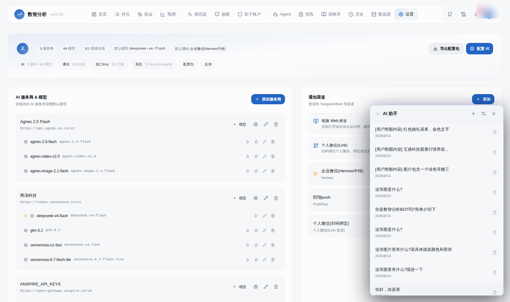
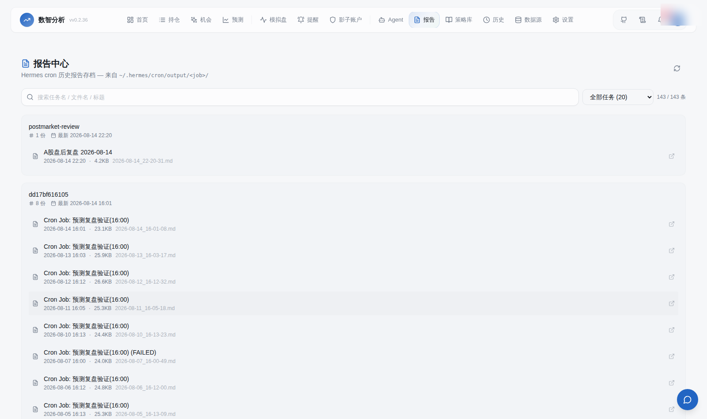

# 数智分析 SIDA · Stock-Intelligent-Data-Analytics

**多用户 A 股智能分析系统 —— 数据、AI 分析、预测、对话、推送全链路打通**

SIDA 把 A 股行情数据、AI 深度分析、多模型预测、双向对话和个人微信推送整合成一条完整的智能链路：**数据进来 → AI 看懂 → 模型预测 → 与你对话 → 推到你手机**。


> 首页：今日报告 / 指数 / 大盘资金流 / 异动池 / 热榜 一屏总览

---

## ✨ 核心亮点

### 1. AI 全链路打通
行情 → 主力意图/技术面/资金流分析 → 4 模型预测 → AI 裁判裁决 → 对话助手解读 → 微信推送，**全链路 AI 参与，每个环节可追溯**。

### 2. 微信双向对话（个人微信 iLink 直连）
扫码绑定个人微信（腾讯官方 iLink 协议），**在微信里直接和「数智分析BOT」对话**：问个股、发图片（K线截图/交割单）、发文件（Excel/PDF）、发链接，AI 都能处理并回复。

### 3. 内置报告生成
交易日自动生成**盘前（8:30）/ 盘后（15:30）报告**：真实市场数据 + AI 解读，直接归集报告中心。无需任何外部依赖。

### 4. 多智能体分析
- **TradingAgents 深度分析**：分析师辩论 + PM 决策
- **主力意图五件套**：超大单背离 / 量价背离 / 时段节奏 / 托压单识别 / AI 反证
- **AI 裁判层**：LLM 裁决 4 模型预测方向

### 5. 多用户隔离 + 统一 AI 配置
持仓/自选/通知按用户隔离；**统一 LLM 配置中心**：服务商 + 模型池 + 7 场景绑定（对话/报告/裁判/自检/评分/深度分析/视觉代理）。

---

## 📊 功能总览

| 模块 | 能力 |
|---|---|
| **行情数据** | 腾讯/东财/同花顺/新浪多源接入：实时行情、K线、分时、资金流、主力意图（逐笔）、集合竞价、涨停复盘、热榜、异动池 |
| **AI 对话助手** | 19+ 数据工具（主力意图/资金流/技术面/K线形态/竞价/热点/互动易），流式输出，图片/文件/链接多模态 |
| **微信推送 & 对话** | 个人微信 iLink 直连：机会/信号/提醒推送 + 双向对话（文字/图片/文件） |
| **预测引擎** | Kronos + Chronos-Bolt + XGBoost + 线性回归加权（权重按命中率动态调）+ AI 裁判 |
| **报告中心** | 盘前/盘后报告自动生成归集，30s 刷新，历史存档 |
| **机会发现** | 7 大策略信号、异动池、热榜、题材启动识别 |
| **持仓 & 影子账户** | 交割单解析（Excel/PDF）、交易行为画像、模拟盘 |
| **通知渠道** | 微信(iLink)/企业微信/PushPlus/Server酱/邮件 |







---

## 🚀 快速开始

### 生产部署（Docker）

```bash
# 拉镜像（阿里云 ACR 国内加速）
docker pull crpi-mte80ai8o78b1429.cn-shanghai.personal.cr.aliyuncs.com/xiaozexwz/xzxwz:v0.2.36

# 运行（数据卷持久化）
docker run -d --name sida -p 8000:8000 --restart unless-stopped \
  -v sida_data:/app/data \
  -e AUTH_USERNAME=admin \
  -e AUTH_PASSWORD=<你的密码> \
  -e TZ=Asia/Shanghai \
  -e DATA_DIR=/app/data \
  crpi-mte80ai8o78b1429.cn-shanghai.personal.cr.aliyuncs.com/xiaozexwz/xzxwz:v0.2.36
```

### 开发环境

```bash
# 后端
pip install -r requirements.txt
python server.py

# 前端
cd frontend && pnpm install && pnpm dev
```

---

## 🏗️ 技术架构

| 层 | 技术 |
|---|---|
| 后端 | Python FastAPI + SQLAlchemy + SQLite(WAL) + APScheduler |
| 前端 | React 18 + Vite + Tailwind + ECharts |
| 预测引擎 | Kronos / Chronos-Bolt（时序基础模型）+ XGBoost + 线性回归 |
| 微信通道 | 腾讯官方 iLink Bot API（纯 Python 直连，扫码绑定） |
| AI 配置 | 统一 LLM 配置中心（多服务商 + 场景绑定） |

```
┌─────────────┐   ┌──────────────┐   ┌──────────────┐   ┌────────────┐
│  行情数据源   │ → │ AI 分析层     │ → │  预测引擎     │ → │  报告中心   │
│ 腾讯/东财/   │   │ 主力意图/技术面│   │ 4模型+AI裁判 │   │ 盘前/盘后   │
│ 同花顺/竞价  │   │ 多智能体辩论   │   │ 权重动态调整  │   │ 自动生成     │
└─────────────┘   └──────────────┘   └──────────────┘   └────────────┘
        │                 │                  │                  │
        └───────── AI 对话助手「数智分析BOT」 ←┘                  │
                        │ 图片/文件/链接多模态                     │
                        ▼                                        │
                ┌─────────────┐                                 │
                │ 微信推送/对话 │ ←────────────────────────────────┘
                │ iLink 直连   │
                └─────────────┘
```

---

## 🔐 多用户与配置

- **账号隔离**：持仓、自选、通知渠道、微信绑定均按用户独立
- **统一 LLM 配置中心**：设置页管理服务商（OpenAI 兼容）、模型池、7 场景绑定（含视觉代理——图片识别模型可随时更换）
- **通知渠道**：个人微信（iLink 扫码绑定）/ 企业微信 / PushPlus / Server酱 / 邮件

---

## 📄 开源与许可

本项目计划采用**入门版开源 + 专业版付费**的双版本模式：

| 版本 | 代码 | 功能 | 模型 |
|---|---|---|---|
| **入门版** | 开源 | 核心分析功能 | 自带 key（BYOK） |
| **专业版** | 闭源 | 全部功能（预测/多智能体/微信/报告） | 系统自带模型 |

> 当前仓库为私密状态，分版完成后将开放入门版源码。

---

## ⚠️ 免责声明

本项目仅供技术研究和学习使用，所有 AI 生成的分析、预测、报告仅供参考，不构成任何投资建议。股市有风险，投资需谨慎。

---

## 赞助 Sponsor

如果数智分析对你有帮助，欢迎请作者喝杯咖啡 ☕ 你的支持是持续维护的动力！

| 方式 | 入口 |
|:---:|:---:|
| **微信赞赏** |  |

> 提示：也可点右上角 ⭐ Star 支持项目。
